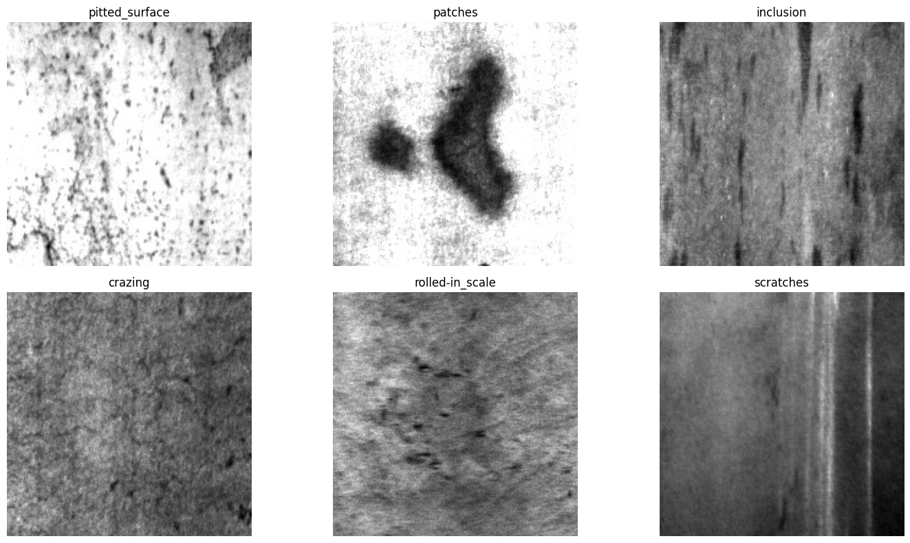

# Steel Surface Defect Classification Using Deep Learning
This is a deep learning-based computer vision project for automated classification of surface defects

## Overview
Steel surface defects provide negative impact on the quality and performance of the finished product. So improving the quality is a must. An automated visual inspection system using computer vision and deep learning can efficiently identify the surface defects and improve the overall performance of the manufacturing system. This project provides a deep learning-based image classification system for identifying different types of defects in the steel surface. 
## Research question
Can a deep learning-based computer vision model accurately classify different types of steel surface defects from the images? 

## Objectives
1. To understand the steel surface image dataset
2. To analyze the distribution of different defect classes
3. To develop a CNN-based image classification model
4. To evaluate the model using an appropriate classification matrix
5. To analyze classification error using a confusion matrix
6. To investigate which defect categories are difficult to distinguish.
7. To explore model interpretability using visualization techniques.

## Dataset
Name: NEU surface defect dataset, which was obtained from Kaggle

Sample images

## Methodology
1. Dataset Exploration
2. Data Cleaning
3. Train / Validation / Test Split
4. Image Preprocessing
5. PyTorch Dataset
6. Model Training
7. Validation
8. Test Evaluation
9. Defect Classification

## Project Status
In Progress

